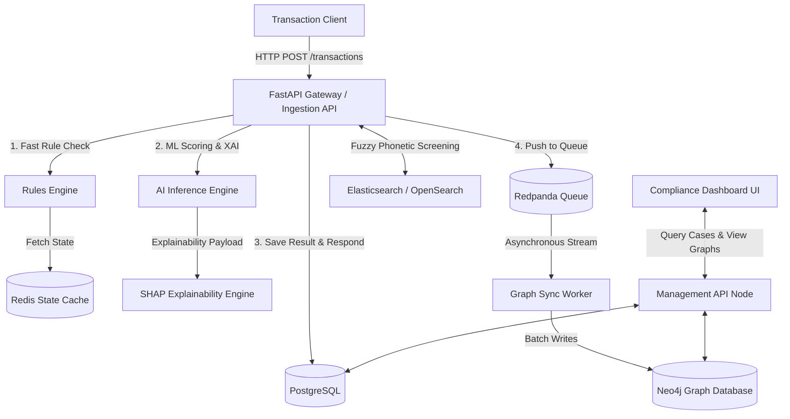
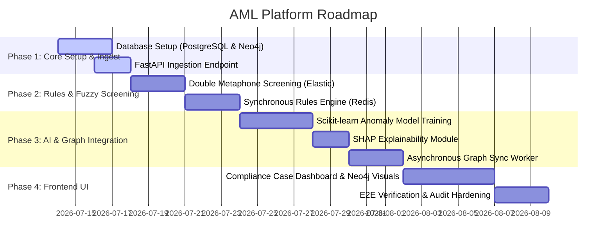

# AML Compliance & Transaction Monitoring Platform - Implementation Plan

This document presents the architecture, database models, API contracts, implementation path, and verification plan for a traditional fiat Anti-Money Laundering (AML) platform built with FastAPI.

---

## High-Level System Architecture

The platform uses a Hybrid Synchronous/Asynchronous Architecture to achieve real-time synchronous scoring while offloading intensive graph database writes and auditing tasks to async workers.



### Key Decisions
* **Synchronous Transaction Scoring:** Transaction requests sent to `POST /api/v1/transactions` will be scored in-line. The API will perform rule matching and ML inference synchronously, returning the compliance decision (`APPROVED`, `HELD`, `REJECTED`) in the HTTP response within < 100ms.
* **Asynchronous Graph & Search Sync:** To prevent Neo4j and Elasticsearch from bottlenecking transaction ingestion throughput, all successfully scored transactions are published to Redpanda/Kafka. A background worker consumes these messages in batches to update the transaction graph.
* **Explainable AI (XAI):** All flagged transactions include a JSON payload containing feature attributions (SHAP values) so compliance officers can see exactly why a transaction was flagged.
* **Multi-Tenant Isolation:** Database schemas (PostgreSQL and Neo4j) are structured with `tenant_id` partitions and Row-Level Security (RLS) to enforce data segregation.

---

## 1. Database Design & Polyglot Schema

### A. Relational Schema (PostgreSQL)
Stores audit logs, account profiles, rule definitions, alerts, and tenant metadata.

```sql
-- Tenant Isolation
CREATE TABLE tenants (
    id UUID PRIMARY KEY DEFAULT gen_random_uuid(),
    name VARCHAR(255) NOT NULL,
    created_at TIMESTAMP WITH TIME ZONE DEFAULT NOW()
);

-- Core Accounts (Traditional Fiat focus: IBAN, SWIFT)
CREATE TABLE accounts (
    id UUID PRIMARY KEY DEFAULT gen_random_uuid(),
    tenant_id UUID REFERENCES tenants(id) NOT NULL,
    account_number VARCHAR(50) UNIQUE NOT NULL, -- IBAN / Local Account Number
    swift_bic VARCHAR(11),
    owner_name VARCHAR(255) NOT NULL,
    risk_score NUMERIC(5, 2) DEFAULT 0.00,
    status VARCHAR(20) DEFAULT 'ACTIVE', -- ACTIVE, SUSPENDED
    created_at TIMESTAMP WITH TIME ZONE DEFAULT NOW()
);

-- Transaction Log (Relational Audit Trail)
CREATE TABLE transactions (
    id UUID PRIMARY KEY DEFAULT gen_random_uuid(),
    tenant_id UUID REFERENCES tenants(id) NOT NULL,
    sender_account_id UUID REFERENCES accounts(id) NOT NULL,
    receiver_account_id UUID REFERENCES accounts(id) NOT NULL,
    amount NUMERIC(15, 2) NOT NULL,
    currency VARCHAR(3) NOT NULL, -- USD, EUR, etc.
    status VARCHAR(20) DEFAULT 'COMPLETED', -- COMPLETED, FLAGGED, HELD, REJECTED
    timestamp TIMESTAMP WITH TIME ZONE NOT NULL
);

-- Indexing for High-Performance Queries
CREATE INDEX idx_transactions_sender_timestamp ON transactions(sender_account_id, timestamp DESC);
CREATE INDEX idx_transactions_receiver_timestamp ON transactions(receiver_account_id, timestamp DESC);

-- Alerts & Case Details
CREATE TABLE alerts (
    id UUID PRIMARY KEY DEFAULT gen_random_uuid(),
    tenant_id UUID REFERENCES tenants(id) NOT NULL,
    transaction_id UUID REFERENCES transactions(id) NOT NULL,
    rule_name VARCHAR(100) NOT NULL, -- e.g., 'STRUCTURING_THRESHOLD', 'HIGH_RISK_GEOGRAPHY'
    threat_level VARCHAR(20) NOT NULL, -- LOW, MEDIUM, HIGH, CRITICAL
    ai_risk_score NUMERIC(5, 2),
    explainability_payload JSONB, -- Attributions (SHAP values)
    status VARCHAR(20) DEFAULT 'NEW', -- NEW, UNDER_INVESTIGATION, CLOSED_SAR, CLOSED_FALSE_POSITIVE
    assigned_officer_id UUID,
    created_at TIMESTAMP WITH TIME ZONE DEFAULT NOW()
);

CREATE INDEX idx_alerts_status ON alerts(status) WHERE status IN ('NEW', 'UNDER_INVESTIGATION');
```

### B. Graph Schema (Neo4j Cypher)
Used to construct transfer chains, discover layered smurfing networks, and represent Ultimate Beneficial Ownership (UBO) structures.

```cypher
// Constraints
CREATE CONSTRAINT FOR (a:Account) REQUIRE a.id IS UNIQUE;
CREATE CONSTRAINT FOR (p:Person) REQUIRE p.tax_id IS UNIQUE;
CREATE CONSTRAINT FOR (c:Company) REQUIRE c.registration_number IS UNIQUE;

// Core Nodes & Relationships
// (:Account)-[:TRANSFERS_TO {amount: float, timestamp: int (epoch)}]->(:Account)
// (:Person)-[:OWNS_UBO {percentage: float}]->(:Company)
// (:Account)-[:BELONGS_TO]->(:Company) or (:Account)-[:BELONGS_TO]->(:Person)

// Query: Find circular transaction loop within a 24-hour window (layering/smurfing detection)
MATCH path = (a:Account)-[t1:TRANSFERS_TO]->(b:Account)-[t2:TRANSFERS_TO]->(c:Account)-[t3:TRANSFERS_TO]->(a)
WHERE t1.timestamp < t2.timestamp 
  AND t2.timestamp < t3.timestamp 
  AND t3.timestamp - t1.timestamp <= 86400
RETURN path LIMIT 10;
```

---

## 2. API Contract Design

### A. KYC/KYB Onboarding & UBO Mapping
* **POST** `/api/v1/onboard/individual`
  * Submits individual profiles and matches against PEP/sanctions.
* **POST** `/api/v1/onboard/corporate`
  * Submits corporate registry info to build Ultimate Beneficial Owner (UBO) relationships in Neo4j.

### B. PEP & Sanction Screening (Fuzzy Phonetic Search)
* **POST** `/api/v1/screening/search`
  * Matches names using Double Metaphone phonetics.
  * **Request Body:**
    ```json
    {
      "name": "Vladimir Smirnov",
      "date_of_birth": "1974-05-12",
      "threshold": 0.85
    }
    ```
  * **Response Body:**
    ```json
    {
      "match_found": true,
      "score": 0.94,
      "source_list": "OFAC Specially Designated Nationals (SDN)",
      "matched_entry": {
        "name": "Wladimir Smirnow",
        "reason": "Phonetic match via Double Metaphone"
      }
    }
    ```

### C. Transaction Monitoring API
* **POST** `/api/v1/transactions`
  * Synchronously scores transaction against rules and AI anomaly engine.
  * **Request Body:**
    ```json
    {
      "sender_account": "ACC-DE1200340056",
      "receiver_account": "ACC-US9988776655",
      "amount": 12500.00,
      "currency": "USD",
      "timestamp": "2026-07-13T10:35:00Z"
    }
    ```
  * **Response Body:**
    ```json
    {
      "transaction_id": "8f3b9c2a-1122-3344-5566-778899aabbcc",
      "decision": "HELD", -- APPROVED, HELD, REJECTED
      "alert_triggered": true,
      "risk_score": 0.89,
      "triggered_rules": ["SUSPICIOUS_TRANSFERS_THRESHOLD"],
      "explainability": {
        "attributions": {
          "amount_deviation": 0.45,
          "geographical_risk": 0.32,
          "velocity_24h": 0.12
        }
      }
    }
    ```

### D. Case & Alert Management
* **GET** `/api/v1/alerts`
  * Retrieve list of open alerts for compliance officers.
* **POST** `/api/v1/alerts/:id/action`
  * Resolves cases and generates regulatory Suspicious Activity Reports (SARs) XML payload.

---

## 3. Step-by-Step Implementation Path



---

## 4. Verification Plan

### Automated Tests
* **Rules Engine & ML Scoring Tests:**
  * Unit tests validating specific rule logic (e.g., transaction > $10,000 structuring checks).
  * Mock inference tests to ensure PyModel output structures and SHAP attributions are correctly formatted.
* **Latency Benchmarks:**
  * Run benchmark scripts simulating 100 concurrent requests to `/api/v1/transactions` to guarantee < 100ms P99 latency.
* **Async Graph Sync Integration Tests:**
  * Publish test transaction to Redpanda queue, assert that the Neo4j database is eventually updated with the correct account node and transfer edge.

### Manual Verification
* **Sanctions Screening Fuzzy Test:**
  * Submit phonetic variations of blocked entities and assert that matching triggers with correct thresholds.
* **Case Management UI Walkthrough:**
  * Simulate a flagged transaction, check the Compliance Dashboard, confirm the SHAP values explainability cards render correctly, and visually inspect the Neo4j transaction graph path.
